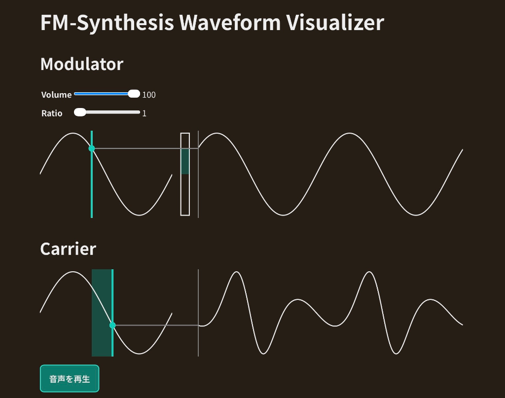

# FM-Synthesis Waveform Visualizer for Web

YAMAHA DX7に代表されるようなFMシンセサイザーがどのように波形を生成しているのかの学習に役立つWebアプリです。

# 簡単な使い方

FMシンセサイザーにキャリア・モジュレーターがあることはわかるけどそれがどうやって波形を生成しているのかがわからない、といった方に向けて作っています。

"Modulator"内の"Volume"・"Ratio"のスライダーを動かすことで、"Carrier"の位相や波形にどのような影響を与えるのかを観察することができます。

"Carrier"下の"音声を再生する"ボタンをクリックすることで、実際のFMシンセサイザーの音を聞くことができます。  
この音は画面上の波形とサンプリングレート・周波数が違うだけで、実際に同じ波形の音を聞くことができます。

## (確認済みの)動作環境

- iPadOS 26.2, Safari

## インストール方法

Releasesから最新のバージョンをダウンロードしてPCの任意のディレクトリ(ドキュメントフォルダなど)内に配置し、その中の`index.html`をブラウザで開いてください。

## ライセンス

このプロジェクトはMIT Licenseのもとで公開されています。  
[https://opensource.org](https://opensource.org)

## 謝辞

### 使用したライブラリ

- [Normalize.css](https://necolas.github.io/normalize.css/) - Developed by Nicolas Gallagher([@necolas](https://github.com/necolas))

## 作者

### Igarin

- GitHub: [@igarin14pm](https://github.com/igarin14pm)
